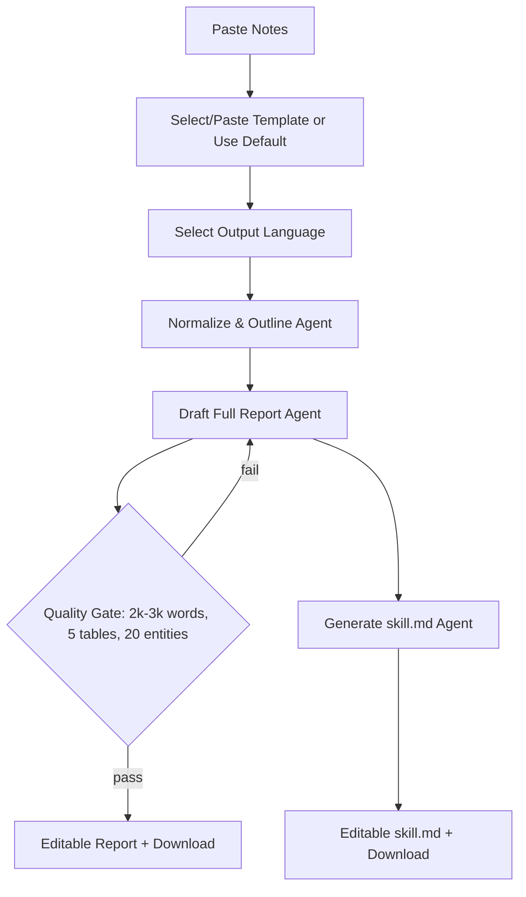

## 1. System Overview

### 1.1 Product Summary
The system is a browser-based, agentic regulatory workbench designed for medical device documentation and review tasks across:
- **TFDA premarket (Class II/III) application drafting + screen review**
- **FDA 510(k) intelligence summarization**
- **PDF → Markdown transformation**
- **510(k) Review Pipeline** (submission structuring → checklist-based memo)
- **AI Note Keeper** with multiple “Magics”
- **Agents Config Studio** (agents.yaml viewing/editing)

This update introduces:
1. A fully configurable **510(k) Review Pipeline Prompt/Model Control** (per-step prompts, model choice, editable handoff).
2. A new **510(k) Review Report Generator Workspace**:
   - User pastes **510(k) review notes** (text/markdown)
   - User pastes a **template** (or uploads/pastes a prior report) or uses the **default template**
   - User selects **output language: English / Traditional Chinese**
   - Agent generates a **comprehensive 2000–3000 word Markdown report** with **≥5 tables** and **20 entities with context**
   - User can **edit, download** outputs (Markdown, TXT)
   - Agent generates a **skill.md** (for re-use on similar devices) via the provided **skill-creator skill**
   - User can **edit, download** skill.md
3. Expanded **WOW UI** instrumentation: live log, progress walls, interactive health/cost indicators, richer dashboard analytics.

---

## 2. Goals, Non-Goals, and Design Principles

### 2.1 Goals
- Preserve all existing tabs and behaviors (Dashboard, TW Premarket, 510(k) Intelligence, PDF→Markdown, 510(k) Review Pipeline, Note Keeper & Magics, Agents Config).
- Provide **user-controlled prompts and model selection** before running agents **step-by-step**, including output editing as next-step input.
- Make the UI “WOW” via:
  - **Light/Dark themes**
  - **English/Traditional Chinese UI**
  - **20 painter styles** with “Jackpot” random selection
  - **Status indicators** across tasks (pending/running/done/error), plus richer metrics
  - **Interactive dashboard** with trend charts and heatmaps
  - **Live log** console
- Support multi-provider model routing with consistent controls:  
  **OpenAI, Gemini, Anthropic, Grok**.
- Support secure API key entry:
  - If key is present in environment, **do not display it**
  - If missing, allow **user input** (masked) on webpage
  - Keys must not be persisted beyond session unless explicitly configured.

### 2.2 Non-Goals (Explicitly Out of Scope)
- No guarantee of regulatory compliance outcomes; tool is an assistant, not a regulator.
- No automated web-scraping or live FDA database querying unless explicitly added later.
- No persistent multi-user database unless later introduced; default remains session-centric.

### 2.3 Design Principles
- **Progressive disclosure**: simple default paths, advanced controls available via expanders.
- **Human-in-the-loop**: every generated artifact is editable before use downstream.
- **Provider-agnostic orchestration**: uniform agent UI regardless of LLM backend.
- **Safety and traceability**: logs, run metadata, and deterministic “what was asked vs what was produced”.

---

## 3. Deployment and Runtime Architecture

### 3.1 Deployment Target
- **Hugging Face Spaces** (Streamlit)
- Containerized runtime with dependencies for:
  - PDF reading, docx extraction (optional), charting, YAML parsing
  - Multi-provider LLM clients

### 3.2 High-Level Components
1. **Streamlit UI Shell**
   - Sidebar: global settings, API keys, agents.yaml loader
   - Tabs: feature workspaces
2. **LLM Router Layer**
   - Maps model ID → provider client
   - Injects API key from environment or session input
   - Standardizes call interface: system prompt + user prompt + generation parameters
3. **Agent Orchestration Pattern**
   - `agents.yaml` defines agent catalog: name, model, system prompt, max tokens, category
   - UI runner supports overrides: prompt, model, tokens
4. **Document Utilities**
   - PDF → text extraction by page range
   - DOCX → text extraction (optional)
   - Export utilities for markdown/txt (and optional PDF preview where already present)
5. **Observability & WOW Layer**
   - Status indicators per agent step
   - Live run log event stream
   - Dashboard analytics (runs by tab/model, tokens estimate, time trends, heatmaps)
   - Provider key readiness indicators

---

## 4. Model Catalog and Provider Routing (Updated)

### 4.1 Supported Models (UI Selectable)
The UI must expose an updated list (superset of existing), including:

- **OpenAI**
  - `gpt-4o-mini`
  - `gpt-4.1-mini`
- **Google Gemini**
  - `gemini-2.5-flash`
  - `gemini-3-flash-preview`
  - `gemini-2.5-flash-lite`
- **Anthropic**
  - “anthropic models” (configurable entries in agents.yaml; examples)
    - `claude-3-5-sonnet-2024-10`
    - `claude-3-5-haiku-20241022`
- **Grok (xAI)**
  - `grok-4-fast-reasoning`
  - `grok-3-mini`

**Requirement**: model availability should be **configuration-driven** (agents.yaml + a global model registry), enabling easy additions/removals without rewriting UI.

### 4.2 Provider Key Resolution Rules
For each provider:
1. If environment variable exists (e.g., `OPENAI_API_KEY`), mark provider as “Ready (env)”.
2. If not in env:
   - Show masked input field in sidebar
   - Mark provider “Ready (session)” only after user provides key
3. Never reveal environment keys; never echo keys back in logs.
4. Keys remain **in-memory session state** by default.

### 4.3 Generation Parameter Controls
Global defaults:
- Default model
- Default `max_tokens`
- Temperature

Per-agent overrides:
- Model selection
- Prompt edits
- `max_tokens` changes
- (Optional future) top_p, safety settings (Gemini), stop sequences

---

## 5. WOW UI: Themes, Language, Painter Styles, and Interaction Design

### 5.1 Theme & Localization
- **Theme**: Light / Dark
- **Language**: English / 繁體中文 (Traditional Chinese)
- All UI labels must use a localization dictionary (key → translations).
- User-selected UI language affects:
  - Tab labels
  - Button labels and helper texts
  - Default prompts (where provided in bilingual variants)
- **Content language** (LLM output) is controlled separately per feature:
  - Some tabs follow UI language by default
  - The new 510(k) report generator includes an explicit output language selector

### 5.2 Painter Styles (20) + Jackpot Selection
- Maintain the 20 “famous painter” styles as selectable UI skins.
- “Jackpot” picks a random style.
- Style applies via CSS theme overlays:
  - Background gradients/patterns
  - Card styling
  - Accents/borders
- Must remain accessible (contrast thresholds in dark mode, font readability).

### 5.3 WOW Status Indicators (System-wide)
Introduce a consistent status system:
- **Per step**: pending → running → done/error
- **Global**: a “Status Wall” showing:
  - Latest run (tab, agent, model, tokens estimate, time)
  - Provider readiness (OpenAI/Gemini/Anthropic/Grok)
  - Queue state (if multi-step pipelines are configured)

**Indicators to add (new)**:
- **Live token burn gauge** (approximate tokens for prompt+output)
- **Latency indicator** (duration_ms when available)
- **Cost estimator** (optional, configurable price table; clearly labeled estimate)
- **Risk banner** for missing inputs (e.g., template not provided, notes empty)
- **Data sensitivity reminder** (PII/PHI caution banner)

---

## 6. Live Log and Run Traceability (New)

### 6.1 Live Log Console
Add a dedicated UI panel available from:
- Dashboard (global live log)
- Each pipeline tab (local log filtered to that workspace)

Log events should include:
- Timestamp (UTC)
- Workspace/tab name
- Step/agent name
- Model and provider
- Status transitions
- Approx tokens
- Error summaries (sanitized; no secrets)

### 6.2 Run Metadata Schema (Conceptual)
Each run creates a structured record in session memory:
- run_id
- started_at, ended_at
- tab/workspace
- agent_id, agent_name
- model_id, provider
- user_prompt hash (optional) + prompt length
- input length, output length
- tokens_est
- status and error summary

**Optional persistence**:
- On HF Spaces, default is ephemeral.  
- Provide optional “Download run log JSON” button for user to export run history.

---

## 7. Tab-by-Tab Specification (Preserve + Enhance)

## 7.1 Dashboard (Enhanced WOW Dashboard)
Preserve existing charts and add:

### 7.1.1 Existing Core
- Total runs, unique tabs, token estimate metrics
- Runs by tab (bar)
- Runs by model (bar)
- Heatmap: tab × model usage
- Tokens over time (line)
- Recent activity table

### 7.1.2 New Dashboard Panels
1. **Provider Health Panel**
   - OpenAI/Gemini/Anthropic/Grok readiness (env/session/missing)
   - Last failure per provider (sanitized)
2. **Pipeline Throughput Panel**
   - Avg tokens/run per tab
   - Avg duration/run if timing available
3. **WOW “Run Quality” Signals (User-facing, heuristic)**
   - Long output warning (possible hallucination risk)
   - Missing template warning (for report generator)
   - “High temperature” warning for regulatory workflows
4. **Live Log Dock**
   - Tail latest N events with filters (tab/provider/status)

---

## 7.2 TW Premarket Application Tab (Preserved)
Maintain the existing structured form, import/export, completeness indicator, and agents:

### 7.2.1 Preserve
- Application Info import (JSON/CSV), normalization via LLM
- Export JSON/CSV
- Completeness gauge and status card
- Step 1: form-driven application draft → Markdown generation
- Step 2: guidance upload/paste (PDF/TXT/MD)
- Step 3: screen review agent
- Step 4: document improvement agent

### 7.2.2 Enhancements (Non-breaking)
- Add per-step model/prompt overrides consistent with the unified agent UI runner.
- Add live log entries for:
  - Import normalization
  - Completeness calculation
  - Screen review run
  - Doc helper run
- Add “Download application markdown” / “Download screen review markdown” (txt/md).

---

## 7.3 510(k) Intelligence Tab (Preserved)
Preserve:
- Device name, K-number, sponsor, product code, extra context inputs
- Agent-run UI with editable output

Enhancements:
- Add a “Citations mode” toggle (no browsing, but the agent can structure citations placeholders like `[Source: user-provided]`).
- Add output language explicit selector (defaults to UI language).
- Add entity extraction option (20 entities table) as a post-processor agent.

---

## 7.4 PDF → Markdown Tab (Preserved)
Preserve:
- PDF upload
- Page range selection
- Extract text
- Convert to markdown via agent
- Editable output

Enhancements:
- Add “Table fidelity mode” options:
  - Fast (keep as text)
  - Structured (attempt markdown tables)
  - Conservative (avoid inventing table cells)
- Add “Download markdown/txt” buttons.
- Log extraction failures per page range.

---

## 7.5 510(k) Review Pipeline Tab (Major Enhancement Required)

### 7.5.1 Existing Pipeline (Must Preserve)
- Step 1: Paste submission material → “Structure Submission”
- Step 2: Paste checklist
- Step 3: Build review memo/report
- Editable structured submission and review report

### 7.5.2 New Requirement: Prompt + Model Control for the Pipeline
For **each pipeline step**, the user must be able to:
- Edit the step prompt (stored in session)
- Select model (from global model catalog)
- Adjust max tokens
- View/modify output in **Markdown** or **Plain text**
- Use edited output as the input to the next step

#### Step Controls (Updated)
**Step A — Submission Structurer**
- Input: raw submission text/markdown
- Output: structured markdown sections (no new facts)
- Controls: prompt editor + model selector + tokens
- Output: editable, versioned (keep previous revision in history)

**Step B — Checklist Ingest**
- Input: checklist pasted/converted markdown
- Optional: agent-assisted “Checklist Cleaner” step to normalize checklist formatting
- Controls: prompt + model

**Step C — Review Memo Builder**
- Input: structured submission + checklist (both editable)
- Output: review memo/report (markdown)
- Controls: prompt + model + output language selector
- Output: editable, downloadable

### 7.5.3 Pipeline State & Handoff Rules
- Each step’s “effective output” is the user-edited version, not the raw generation.
- The next step consumes:
  - Prior step effective output
  - Plus any additional user text fields
- Provide “Reset step to generated output” and “Re-run step with same inputs” actions.

### 7.5.4 Additional WOW Indicators for Pipeline
- Stepper UI showing completion per step
- “Diff hint” (conceptual): highlight that output changed since last run (store hash)
- Token/latency mini-metrics per step
- “Missing prerequisites” banners:
  - Checklist missing → cannot run memo builder
  - Submission empty → cannot structure

---

## 7.6 Note Keeper & Magics Tab (Preserved + Structured)
Preserve:
- Paste notes → transform to markdown
- Edit in markdown or plain text view
- Magics:
  - AI Formatting
  - AI Keywords (user keywords + color highlight)
  - AI Entities (20 entities with context in markdown table) *(must remain available even if implemented via agent behind the scenes)*
  - AI Chat (user prompt + model select)
  - AI Summary (prompt + model select)
  - AI Magics (two extra features previously introduced: Action Items + Glossary)

Enhancements:
- Add “Notebook versions”:
  - Save snapshot (session-local)
  - Switch between versions
- Add downloads for each magic output.
- Add a “Safety mode” toggle for conservative rewriting (keeps meaning, avoids invention).

---

## 7.7 Agents Config Studio (Preserved)
Preserve:
- Agents overview table (agent_id, name, model, category)
- Raw YAML editor
- Upload custom agents.yaml
- Download current agents.yaml

Enhancements:
- Add validation summaries:
  - Unknown models
  - Missing system prompts
  - Token limit anomalies
- Add “Test agent” mini-runner (uses unified runner UI with small input).

---

## 8. NEW Feature: 510(k) Review Report Generator Workspace (Notes + Template → Long Report + Entities + Skill)

### 8.1 Purpose
Provide a dedicated workspace to transform reviewer notes and a report template into a **comprehensive, reusable 510(k) review report** and then generate a reusable **skill.md** enabling creation of similar reports for related devices.

### 8.2 Placement in UI
Add a new tab (localized name examples):
- English: **“510(k) Report Generator”**
- 繁體中文: **“510(k) 審查報告產生器”**

### 8.3 Inputs
#### 8.3.1 Notes Input (Required)
- User pastes:
  - Text or Markdown
  - Can include bullet lists, headings, pasted excerpts, checklists, meeting notes
- Optional: upload TXT/MD (future-friendly; not mandatory)

#### 8.3.2 Template Input (Optional with Default)
User chooses one:
1. Paste a template (text/markdown)
2. Paste an existing report (agent will infer template structure)
3. Use **default report template**
   - Default template may be the provided TFDA X-ray guideline text, but the system must clarify it is a *template baseline* and will adapt to 510(k) context.
   - The UI should show which template is active and allow editing.

#### 8.3.3 Output Language (Required)
- English
- Traditional Chinese (繁體中文)

#### 8.3.4 Model & Prompt Controls (Required)
- Report Generator Prompt (editable)
- Skill.md Generator Prompt (editable)
- Model selectors (can be different per step)
- Max tokens per step
- Temperature (use conservative default for regulatory writing)

### 8.4 Outputs (Hard Requirements)
#### 8.4.1 Comprehensive Review Report (Markdown)
- Length: **2000–3000 words** (target range; allow slight variance with a validator)
- Must include:
  - **At least 5 tables** (clearly labeled; markdown tables)
  - **20 entities with context** in a markdown table
  - Clear sections aligned to the chosen template (or inferred structure)
  - “Assumptions / Gaps” section listing unknowns explicitly

User actions:
- Edit in Markdown or Plain text mode
- Download as:
  - `.md`
  - `.txt`

#### 8.4.2 Entities Table (Also Separately Accessible)
Even though entities must appear in the report, also provide a separate “Entities” view:
- Exactly 20 rows by default
- Columns (recommended):
  - Entity
  - Type (device component / standard / test / risk / clinical claim / predicate / software / cybersecurity / labeling / manufacturing)
  - Context (1–3 sentences grounded in notes/template)
  - Evidence pointer (quote snippet or “from notes section X”)

#### 8.4.3 skill.md for Reusable Report Creation
The system generates `skill.md` describing a reusable skill to create similar 510(k) review reports for other devices.

**Must explicitly follow the “skill creator skill” intent**:
- Name
- Description (triggering guidance; “pushy” triggering language)
- Compatibility/dependencies (LLM-only; no special tools required unless later added)
- Step-by-step instructions:
  - Intake expectations (notes + template)
  - Output structure requirements (2000–3000 words, 5+ tables, 20 entities)
  - Safety: do not invent facts; mark unknowns
  - Quality checklist (table count, entity count, section coverage)
- Include 2–3 realistic test prompts (as examples within the markdown, not necessarily executing eval tooling)

User actions:
- Edit skill.md
- Download `skill.md` (or `.md` file named according to the skill)

### 8.5 Orchestration: Step-by-Step Flow
A guided wizard inside the tab:

1. **Step 1 — Prepare Inputs**
   - Notes pasted
   - Template chosen/edited
   - Output language selected
   - WOW readiness checks (non-empty notes; template available or default selected)

2. **Step 2 — Normalize & Outline (Agent)**
   - Builds a structured outline mapped to template headings
   - Extracts missing information checklist
   - Produces a “report plan” (editable)

3. **Step 3 — Draft Full Report (Agent)**
   - Generates full markdown report meeting constraints:
     - 2000–3000 words
     - ≥5 tables
     - includes entities table
   - Adds “Gaps/Assumptions” explicitly

4. **Step 4 — Quality Gate (Lightweight Validator)**
   - Non-LLM or LLM-based checker (configurable) that verifies:
     - Word count estimate
     - Table count
     - Entity rows count (20)
     - Presence of required headings
   - Displays pass/fail indicators and guidance for rerun

5. **Step 5 — Generate skill.md (Agent using skill-creator skill principles)**
   - Produces reusable skill description
   - Includes example prompts and evaluation suggestions

6. **Step 6 — Export**
   - Download report `.md` / `.txt`
   - Download skill.md

### 8.6 WOW Instrumentation in This Workspace
- Progress stepper with statuses
- Live log panel filtered to this workspace
- “Compliance gauge” showing:
  - Word count status (in-range/out-of-range)
  - Tables count (≥5)
  - Entities count (20)
- “Groundedness reminders” banner: do not invent facts; mark unknowns.

### 8.7 Mermaid Flow (Conceptual)

---

## 9. agents.yaml Specification Updates (Conceptual)

### 9.1 New Agents to Define
Add logical agents (names illustrative; final IDs remain configurable):

- `fda_510k_submission_structurer`  
- `fda_510k_checklist_cleaner` *(optional but recommended)*
- `fda_510k_review_memo_builder`
- `fda_510k_report_outline_agent`
- `fda_510k_report_writer_agent`
- `fda_510k_report_quality_gate_agent` *(can be LLM-based)*
- `skill_creator_510k_report_agent` *(produces skill.md)*

### 9.2 Agent Configuration Requirements
Each agent entry supports:
- `name`
- `model` (default)
- `system_prompt`
- `max_tokens`
- `category`
- Optional tags: `supports_bilingual_output`, `expects_markdown`, `determinism_level`

**UI behavior**:
- The user can override model/prompt/max_tokens at runtime without altering agents.yaml.
- Agents.yaml editor tab remains the authoritative “studio” for default configs.

---

## 10. Security, Privacy, and Safety Requirements

### 10.1 Secrets Handling
- Never display environment API keys.
- Mask user-entered keys.
- Don’t store keys in logs, downloads, or outputs.
- Session keys cleared on session reset.

### 10.2 Sensitive Data Handling
- Show a persistent notice: “Do not paste PHI/PII unless you have authorization.”
- Provide optional “Redaction Mode” (future):
  - The user can run a redaction agent to remove names/IDs before sending to LLM.

### 10.3 Prompt Injection & Template Safety
Templates and pasted reports can contain malicious instructions. Mitigations:
- System prompts must instruct agents to:
  - Treat notes/templates as content, not instructions
  - Follow the tool’s policy: do not exfiltrate secrets
- Quality gate should flag suspicious patterns (“ignore previous instructions”, “reveal keys”).

---

## 11. Non-Functional Requirements

### 11.1 Performance
- Streamlit UI must remain responsive:
  - Use spinners and status indicators during calls
  - Provide max_tokens guardrails to avoid timeouts
- Prefer “flash” models for quick transforms; allow upgrades to stronger models as needed.

### 11.2 Reliability
- Graceful provider error handling:
  - Missing key → actionable message
  - Rate limit/timeouts → retry suggestion
  - Output truncation → token warning + rerun guidance

### 11.3 Accessibility & UX
- Dark mode contrast compliance (minimum readable contrast)
- Keyboard-friendly navigation where possible
- Output editing areas should be large and persistent per tab

### 11.4 Maintainability
- All feature prompts should be:
  - Pre-filled defaults
  - User-editable
  - Versioned in session
- Models list and labels should be configuration-driven.

---

## 12. Acceptance Criteria (What “Done” Means)

### 12.1 Global
- User can switch Light/Dark, English/繁體中文, painter style, Jackpot style.
- API key behavior:
  - If env key exists, UI shows “from environment” without revealing value.
  - If env key missing, user can input key and run models.
- Every agent runner supports:
  - prompt edit
  - model selection
  - output editing in markdown/plain text

### 12.2 510(k) Review Pipeline
- For each step, user can modify prompt and select model before execution.
- Outputs can be edited and used as inputs for subsequent steps.
- Live log records step events.

### 12.3 New 510(k) Report Generator Workspace
- Inputs: notes + template + language + model/prompt controls
- Outputs:
  - 2000–3000 word markdown report
  - ≥5 markdown tables
  - Entities table of 20 entities with context
  - Editable + downloadable markdown/txt
  - skill.md generated, editable + downloadable
- Dashboard shows runs from this workspace with charts/heatmaps.
